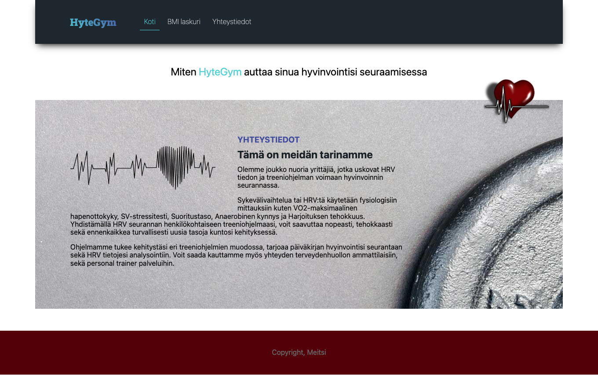
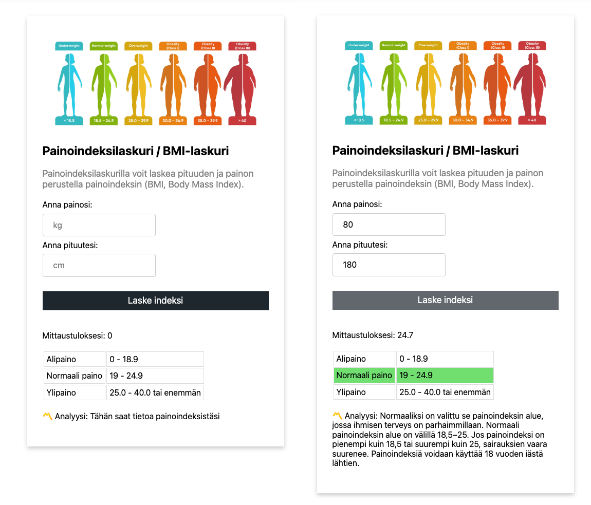

### Tehtävä 1

Meillä jäi viime viikolla käymättä läpi positiointi. Käymme tämän esimerkin kanssa läpi. Positioi tämän jälkeen oma vapaavalintainen kuvasi omille sivuillesi käyttäen absolute positiointia.

# BOM, DOM & Eventit

Kertaamme ensin käsitteitä ensimmäisen vuoden kurssilta:

Bom, Dom ja Eventit

1. [BOM & DOM](https://github.com/ilkkamtk/JavaScript-english/blob/main/BOM-DOM-event.md)

- Tämä on viime vuoden Ohjelmisto2 materiaali
- Pidä materiaali esillä tukimateriaalina

Käy hakemassa alla oleva **harjoituspohja**:

2. [HARJOITUSPOHJA](harjoitukset/vk2-harjoituspohja.html)

- Käytämme tätä pohjaa harjoittelemaan BOM ja DOM manipulointia
- Löydät alla pohjasta kaiken tarvittavan alla olevan tehtävän tekemiseen
- Löydät pohjasta myös linkit tarvittaviin materiaaleihin
- Julkaisen harjoituspohjan ratkaisut tuntien jälkeen

### Viikkotehtävä - BMI Laskin

Teemme tunneilla mahdollisimman valmiiksi BMI laskurisivuston. Mikäli osaat itsenäisesti rakentaa alla olevan näkymän sekä sivuston toiminnallisuudet, voit työstää tuntitehtävää omaan tahtiin. BMI laskuritehtävän kriteerit:

- sivuston tulee laskea käyttäjän input kenttiin syöttämistä arvioista BMI arvon sekä tulostaa sen sivuille
- tuloksen lisäksi sivusto värjää taulukossa näkyvän oikean arvon
- analyysikohtaan sovellus tulostaa erilaisen kuvauksen jokaista BMI arvoa kohden, matala, normaali ja korkea

