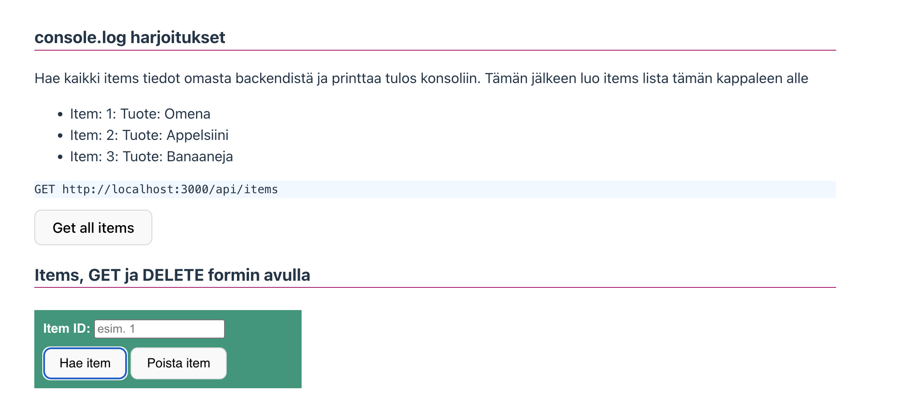
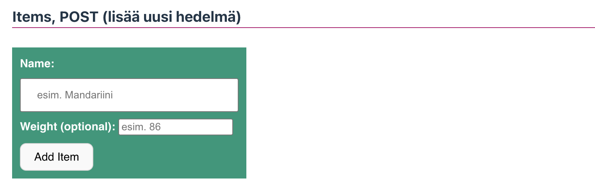
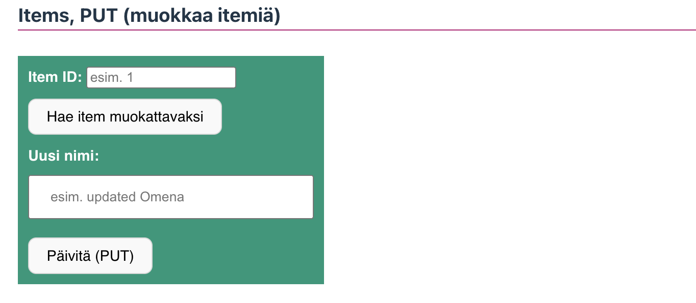
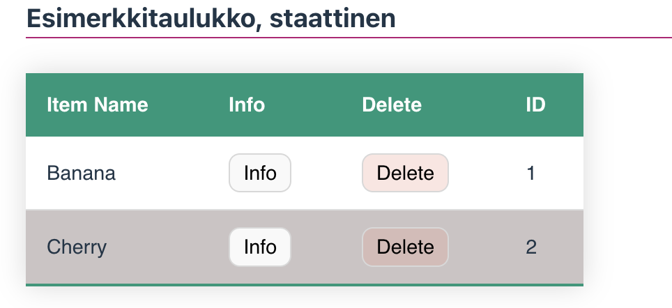

# Fetch API, Rajapintatestaus

Täällä viikolla keskitymme harjoittelemaan rajapintakutsuja. Rakennamme Vite-projektin, jossa haet, lisäät ja poistat käyttäjiä API:sta. Muokkaa jälleen pohja kauniimmaksi ja sopivaksi omaan sivustoosi.

Teemme harjoitukset suoraan vite-ympäristöön. Laitamme samalla rakenteen sivuilla kuntoon. Luo uudet kansiot css, js ja siirrä style.css sekä main.js uusi kansioihin. Korjaa myös polut viittaamaan oikeisiin tiedostoihin. Tee myös fetch.js, items.js ja users.js tiedostot. Ne voivat olla kaikki tyhjiä. Testaa, että kaikki toimii ja saat ajettua projektin virheettä.


**fetchtestaus.html** → rajapintaharjoittelun html pohja.<br>
**main.js** → Pääasiallinen aloituspiste, joka yhdistää eri osat (event listenerit, importit jne.).<br>
**fetch.js** → Yleinen tiedosto API-pyyntöjen tekemiseen (uudelleenkäytettävä). <br>
**items.js** → Hoitaa tavaroiden haun, konsoliin tulostamisen.<br>
**users.js** → Hoitaa käyttäjien haun, lisäämisen ja poistamisen sekä UI:n päivittämisen.

**Virheenkäsittely ja viestit**

**Snackbar-viestit** näyttävät onnistumiset ja virheet.<br>
**fetch.js** näyttää virheilmoitukset, jos API kutsu epäonnistuu. Virheilmoitukset tulevat backendin tarjoamasta message objektista.

# Fetch API

1. [Fetch ensimmäiseltä vuodelta](https://github.com/ilkkamtk/JavaScript-english/blob/main/apit-ajax.md#fetch-api)
   - Käy läpi JSON ja Fetch API

2. [Fetch API - MDN](https://developer.mozilla.org/en-US/docs/Web/API/Fetch_API)

Fetch API on moderni JavaScript-ohjelmointirajapinta, joka tarjoaa käyttöliittymän verkkopyyntöjen (esim. HTTP-pyyntöjen) tekemiseen web-selaimissa ja Node.js-ympäristöissä. Se on suunniteltu olemaan joustavampi ja tehokkaampi kuin vanhempi XMLHttpRequest.

Fetch API:lla on seuraavat keskeiset piirteet:

1. Yksinkertaisuus ja selkeys: Fetch API käyttää suoraviivaista ja Promisen perusteella toimivaa syntaksia, mikä helpottaa asynkronisten operaatioiden käsittelyä.

2. Promise-pohjainen: Fetch palauttaa Promisen, joka ratkeaa kyseiseen pyyntöön liittyvään Responseen, olipa se onnistunut tai ei.

3. Jäsennellymmät Request- ja Response-objektit: Fetch API esittelee jäsennellymmät Request- ja Response-objektit, mikä mahdollistaa pyyntöjen ja vastausten käsittelyn yhtenäisemmällä tavalla.

Tässä on yksinkertainen esimerkki Fetch API:n käytöstä GET-pyynnön tekemiseen:

```javascript
fetch('https://api.restful-api.dev/objects')
	.then((response) => {
		if (!response.ok) {
			throw new Error('Verkkovastaus ei ollut kunnossa');
		}
		return response.json();
	})
	.then((data) => {
		console.log(data);
	})
	.catch((error) => {
		console.error('Fetch-operaatiossa ilmeni ongelma:', error);
	});
```

Tässä esimerkissä fetch-funktiota käytetään tekemään GET-pyyntö 'https://api.restful-api.dev/objects'. Vastaus tarkistetaan onnistumisen osalta, ja jos se onnistuu, vastauksen JSON-sisältö kirjataan konsoliin.

.catch-lohkoa käytetään käsittelemään mahdolliset fetch-operaation aikana ilmenevät virheet. Fetch on tullut vakiintuneeksi tavaksi tehdä HTTP-pyyntöjä nykyaikaisessa verkkokehityksessä.

# async + await

async ja await ovat JavaScriptin ominaisuuksia, jotka mahdollistavat asynkronisten toimintojen hallinnan ja selkeyttävät asynkronisen koodin kirjoittamista.

**async**: Avainsana, joka määrittelee funktion, joka palauttaa Promise-objektin. Funktion suoritus alkaa normaalisti, mutta mikäli funktiosta palautetaan arvo, se kääritään automaattisesti Promiseen. async-funktioissa voidaan käyttää await-avainsanaa odottamaan toisen async-funktion suorittamisen valmistumista.

**await\***: Avainsana, joka käytetään async-funktion sisällä odottamaan toisen asynkronisen toiminnon, kuten Promise-palauttavan funktion, suorittamisen valmistumista. await-avainsanalla merkitty operaatio "odottaa" sen valmistumista ennen kuin koodin suoritus jatkuu seuraavalla rivillä. await voidaan käyttää vain async-funktioiden sisällä.

Kun käytetään async ja await yhdessä, koodin rakenne muuttuu lineaarisemmaksi ja helpommin ymmärrettäväksi, kun verrataan perinteiseen Promise-pohjaiseen asynkronisen koodin kirjoitustapaan.

Esimerkki async-funktiosta ja await-avainsanan käytöstä:

```javascript
async function getData() {
	try {
		const response = await fetch('https://api.example.com/data');
		const data = await response.json();
		console.log(data);
	} catch (error) {
		console.error('Virhe:', error);
	}
}

getData();
```

Tässä esimerkissä getData on async-funktio, joka käyttää await-avainsanaa odottamaan Fetch API -pyynnön valmistumista ja vastauksen muunnosta JSON-muotoon. Virheiden käsittely tapahtuu try-catch -rakenteessa. Funktio getData kutsutaan sitten suorituksen aloittamiseksi.

## Fetch API – HTTP-metodit ja optiot

Fetch API:lla tehdään HTTP-pyyntöjä backend-rajapintaan. Pyyntö koostuu kahdesta pääosasta:

1. URL – mihin resurssiin ollaan yhteydessä

2. Optiot (options-objekti) – mitä tehdään ja millä tiedoilla

Seuraa luentoa, käymme läpi sekä taulukkojen rakenteen, että itse FETCHin käytön. Valmiiseen pohjaan täytyy pystyä hakemaan kaikki items tiedot sekä users tiedot omasta backendistä. Lisäksi formista täytyy pystyä lisäämään uusi käyttäjä. Mahdolliset virheet sekä onnistumiset tiedon käsittelyssä näytetään sekä konsolissa että tarvittavin toast-viestein käyttäjälle. Viestit jotka käyttäjä näkee on backendin palauttamat response.message tai response.error tiedot.

### Tehtävä - Hae kaikki items tiedot, tulosta konsoliin sekä luo lista sivulle



**GET – hae tietoa**

```http
# Get all items
  GET http://127.0.0.1:3000/api/items
```

```js
fetch('http://localhost:3000/api/items/1', {
	method: 'GET',
});
```

Käytetään tietojen hakemiseen.
Ei sisällä bodya.

### Tehtävä - Hae sekä deletoi yksittäinen item käyttäen formia

DELETE – poista dataa

Poistaa resurssin ID:n perusteella.
Ei bodya.

```http
# Get item with id
  GET http://127.0.0.1:3000/api/items:id
```

```http
# Delete item with id
  DELETE http://127.0.0.1:3000/api/items:id
```

```js
fetch('http://localhost:3000/api/items/4', {
	method: 'DELETE',
});
```

### Tehtävä - Lisää uusi hedelmä käyttäen formia

POST – lisää uutta dataa



Käytetään uuden resurssin luomiseen.
Sisältää body-datan JSON-muodossa.

```http
# Post all items
  POST http://127.0.0.1:3000/api/items
```

```js
fetch('http://localhost:3000/api/items', {
	method: 'POST',
	headers: {
		'Content-Type': 'application/json',
	},
	body: JSON.stringify({
		name: 'Mandariini',
		weight: 86,
	}),
});
```

Post luo uuden resurssin ja backend luo ID:n. Body on pakollinen.

### Tehtävä - Muokkaa haluttua itemiä käyttäen formia

PUT – päivitä olemassa oleva data

Käytetään koko resurssin päivittämiseen ID:n perusteella.



```http
# Update details of a specific item by its ID
  PUT http://127.0.0.1:3000/api/items/:id
```

```js
fetch('http://localhost:3000/api/items/4', {
	method: 'PUT',
	headers: {
		'Content-Type': 'application/json',
	},
	body: JSON.stringify({
		name: 'Päivitetty Mandariini',
		weight: 90,
	}),
});
```

### Tehtävä - Hae items ja generoi niistä taulukko



Haetuista tiedoista generoidaan taulukko dynaamisesti DOM metodeilla ja jokaiselle taulukon jäsenelle generoidaan Info sekä Delete button-elementit. Button elementeille lisätään data-attribuuttina käyttäjän ID jatkokäsittelyä varten.

```html
<tr>
	<td>Banana</td>
	<td><button class="check">Info</button></td>
	<td><button class="del">Delete</button></td>
	<td>1</td>
</tr>
```

Elementtien luominen DOM:ssa tarkoittaa uusien HTML- tai XML-elementtien luomista dynaamisesti JavaScriptillä. Tämä voi sisältää uusien elementtien luomisen tyhjästä, niiden muokkaamisen tai lisäämisen olemassa olevaan dokumenttiin. Elementtien luominen DOM:ssa on tärkeä osa dynaamisten verkkosivujen ja sovellusten kehittämistä, koska se mahdollistaa sisällön ja rakenteen luomisen ja muokkaamisen käyttäjän toiminnan perusteella.

[DOM](https://github.com/ilkkamtk/JavaScript-english/blob/main/BOM-DOM-event.md#document-interface)

```js
items.forEach((item) => {
	const row = document.createElement('tr');

	row.innerHTML = `
      <td>${item.name}</td>
      <td><button class="check" data-id="${item.id}">Info</button></td>
      <td><button class="del" data-id="${item.id}">Delete</button></td>
      <td>${item.id}</td>
    `;

	tableBody.appendChild(row);
});
```

**Jos haluat haastetta:** Taulukon listan jokaisella jäsenellä on info nappula. Lisää toiminto, jossa "Info" nappulaa painamalla haetaan yksittäisen käyttäjän tiedot. Tähän tarvitse data-attribuutteja. Oikeassa projektissa ID olisi syytä ehkä piilottaa, mutta tämän projektin puitteissa ja harjoitteluna on ok, että id on esim. piilotetussa input kentässä tai data-attribuuttina.

```http
### get item by id
GET http://localhost:3000/api/users/:id
```

Jokaisella rivillä on tallennettuna id data-attribuuttiin. Voit hakea kyseisen rivin id tiedot esim. seuraavasti:

```js
////// items.js

// Add event listeners for buttons (Info)
const addButtonEventListeners = () => {
	document.querySelectorAll('.check').forEach((button) => {
		button.addEventListener('click', async (event) => {
			const itemId = event.target.dataset.id;
			alert(`Showing info for user ID: ${itemId}`);
			// TODO: Fetch more info or show item details here
		});
	});
};
```

### Kotitehtävä - Käyttäjien lisääminen

Lisää käyttäjiä formin avulla. Formi lisää uuden käyttäjän nappulasta 'Add User'. Treenaa myös muitakin users reittejä sitä mukaan kun saat ne valmiiksi.

```http
  POST http://localhost:3000/api/users
  content-type: application/json

  {
    "username": "Uusi käyttäjä",
    "password": "salakala",
    "email": "newuser@example.com"
  }
```

### Materiaalia tuntien tueksi

### Selektorit

Tarvitse monenlaisia uusi selektoreita seuraaviin tehtäviin. Käymme näistä tuntien aika useampaa läpi. Tutki seuraavaa linkkiä.

**Selectors**
https://www.w3schools.com/cssref/css_selectors.php

### CSS muuttujat

Vite on luonut meille projektiin valmiin css pohjan. Tutkimme alkuun hieman pohjaa ja CSS muuttujia. Muokkaa esimerkkisivusi pohjaa niin että vaihdat vihreän perusvärin käyttämään CSS muuttujaa.

**CSS Variables**
https://www.w3schools.com/css/css3_variables.asp

### Data-attribuutti

Data-attribuutit ovat tapa sisällyttää lisätietoja HTML-elementtiin, jotka eivät vaikuta elementin ulkoasuun tai käyttäytymiseen suoraan, mutta jotka voivat olla hyödyllisiä JavaScriptin tai muiden ohjelmointikielten käytössä, jotka manipuloivat HTML-sivua dynaamisesti. Sivupohjassa näet taulukon buttoneissa data-id nimisen attribuutin.

```html
<td><button class="check" data-id="1">Info</button></td>
```

Attribuutteja voidaan käyttää JavaScriptissä tiedon hakemiseen, tarkasteluun tai dynamiseen muuttamiseen.

**HTML data- Attribute**
https://www.w3schools.com/tags/att_data-.asp

### Toast / Snackbar

Toast on pieni, väliaikainen ilmoituskomponentti, joka näkyy yleensä näytön reunassa ja katoaa automaattisesti muutaman sekunnin kuluttua. Se on tyypillisesti käytössä käyttöliittymissä antamaan nopeaa palautetta käyttäjälle ilman, että sivua tarvitsee päivittää.

https://www.w3schools.com/HOWTO/howto_js_snackbar.asp
