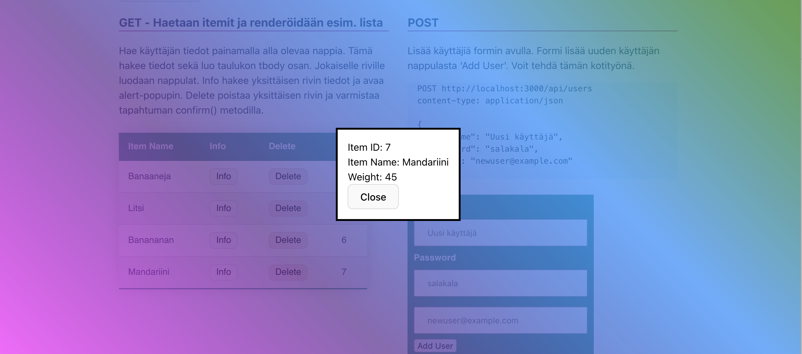
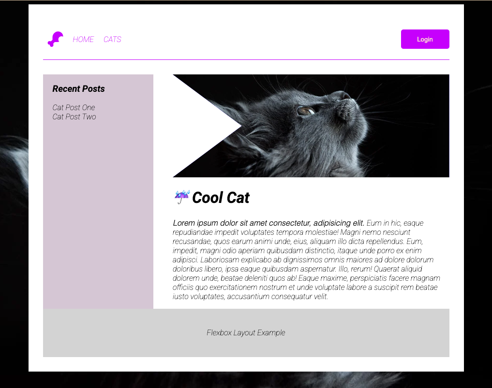
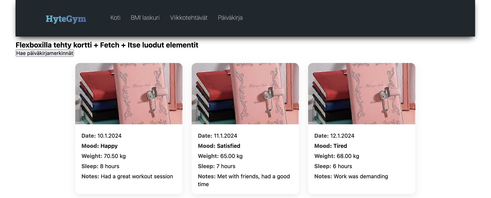

# UIn päivitys, tärkeitä komponentteja ja Flexbox

### Modaalit ja Dialogit

**Tutkitaan ensin perus Modaaleja**

https://www.w3schools.com/howto/howto_css_modals.asp

Modaalien kanssa on perinteisesti ollut jonkunverran hankaluuksia, kuten se, että modaalin tausta yhä scrollaantuu vaikkakin käyttäjällä on modaal auki. Näytän tästä tunnilla pari esimerkkiä. Modaaleja korvaamaan on lähivuosina kehitetty uusi html elementti **dialog** joka tarjoaa natiivin tuen modaaleille.

**Dialog**

https://developer.mozilla.org/en-US/docs/Web/HTML/Element/dialog

Käytämme tänään dialogin luomiseen valmista koodia hieman muunneltuna. Dialogin avaamiseen, kuten modaalien tarvitsen hippasen JS koodia. Katso alla oleve CodePen esimerkki.

- https://css-tricks.com/how-to-implement-and-style-the-dialog-element/
- Lue tämä myös tarkkaan: https://developer.mozilla.org/en-US/docs/Web/API/HTMLDialogElement

Lisätään Dialogille myös Backdrop ominaisuus.

- https://css-tricks.com/almanac/selectors/b/backdrop/ <br>
- https://codepen.io/chergav/pen/zYYbjaE
  <br>

### Tehtävä 1 - Listään testisivuille ensin dialogi

Lisää seuraavat rivit html sivuillesi:

```html
<dialog class="info_dialog">
	<div class="item_info">
		<!-- tähän täytetään items tiedot -->
		<!-- # Get item by id -->
		<!-- GET http://127.0.0.1:3000/api/items/1 -->

		<div>
			ItemID:
			<span>Id</span>
		</div>
		<div>
			ItemName:
			<span>Name</span>
		</div>
		<div>
			Weight:
			<span>Weight</span>
		</div>
	</div>
	<button autofocus>Close</button>
</dialog>
```

Esin lisätään koodi jolla dialogi löytyy sekä se voidaan sulkea.

```js
// Dialog
/////////////////////////////

const dialog = document.querySelector('.info_dialog');
const closeButton = document.querySelector('.info_dialog button');
// "Close" button closes the dialog
closeButton.addEventListener('click', () => {
	dialog.close();
});
```

Lisätään nyt kaikille items listan rivien "Info" dekä "Delete" nappuloille tapahtumankuuntelijat. Kun nappuloita klikataan, haetaan tai poistetaan yksittäisen esineen tiedot taustapalvelusta id perusteella. Mikäli Info nappulaa painetaa, avaa se tiedot dialogiin. Tapahtumankuuntelijat voidaan lisätä samassa funktiossa kuin itse taulukon luominen tapahtuu tai vaihtoehtoisesti omana funktionaan kun taulukko on jo luotu.

```js
const addButtonEventListeners = () => {
	document.querySelectorAll('.check').forEach((button) => {
		button.addEventListener('click', async (event) => {
			const itemId = event.target.dataset.id;
			const item = await getItemById(itemId);

			if (item) {
				// Clicking the info button opens the dialog
				dialog.showModal();
				dialog.querySelector('.item_info').innerHTML = `
          <div>Item ID: <span>${item.id}</span></div>
          <div>Item Name: <span>${item.name}</span></div>
          <div>Weight: <span>${item.weight === undefined ? 'Not available' : item.weight}</span></div>`;
			}
		});
	});

	document.querySelectorAll('.del').forEach((button) => {
		button.addEventListener('click', async (event) => {
			const itemId = event.target.dataset.id;
			deleteItemById(itemId);
			// TODO päivitä UI lista tämän jälkeen
		});
	});
};
```

Tyylittele dialogi ja katso että kaikki tiedot tulostuvat dialogiin.



## Flexbox

Flexbox on CSS3:n osa, joka tarjoaa tehokkaan tavan järjestellä ja hallita elementtejä rivi- ja sarakemuodostelmissa joustavasti ja dynaamisesti. "Flexbox" tulee sanasta "Flexible Box", mikä kuvaa sen kykyä mukautua erilaisiin näyttökoon muutoksiin ja sisällön määriin. Flexbox on erityisen hyödyllinen silloin, kun halutaan luoda responsiivisia ja monipuolisia käyttöliittymiä verkkosivuille tai web-sovelluksiin.

Flexboxin avulla voit määrittää, miten elementit järjestellään, sijoitetaan, venytetään ja kutistetaan suhteessa toisiinsa ja niiden ympäristöön. Flexboxin pääperiaatteita ovat joustavuus, suhteellisuus ja helppokäyttöisyys verrattuna perinteisiin CSS-menetelmiin.

[Loistava Flexbox tietosivu : A Complete Guide to Flexbox](https://css-tricks.com/snippets/css/a-guide-to-flexbox/)

Joitakin tärkeitä käsitteitä ja ominaisuuksia Flexboxissa ovat:

**_Flex Container_**: Elementti, joka sisältää flex-item-elementtejä. Tämä määritellään asettamalla CSS-ominaisuus display: flex; tai display: inline-flex; elementille, jonka haluat toimivan flex-containerina.

**_Flex Items_**: Elementit, jotka ovat suora lapsia flex-containerista ja joihin Flexbox-ominaisuudet vaikuttavat. Ne asettuvat joustavasti flex-containerin sisällä.

**_Main Axis ja Cross Axis_**: Flexboxilla on kaksi pääakselia, pääakseli (main axis) ja poikkeusakseli (cross axis), jotka määritellään flex-containerin suuntaan (flex-direction). Pääakseli on oletuksena vaakasuora ja poikkeusakseli pystysuora.

**_Justify Content_**: Ominaisuus, joka määrittää flex-itemien sijoittelun pääakselin suunnassa flex-containerissa.

**_Align Items ja Align Content_**: Ominaisuudet, jotka määrittävät flex-itemien ja flex-containerin välistä sijoittelua poikkeusakselin suunnassa.

**_Flex Grow, Flex Shrink ja Flex Basis_**: Ominaisuudet, jotka määrittävät flex-itemien joustavuuden ja niiden käyttäytymisen suhteessa toisiinsa.

Flexbox tarjoaa monipuolisia mahdollisuuksia layoutien hallintaan ja on tullut yhdeksi tärkeimmistä työkaluista responsiivisen suunnittelun ja joustavien käyttöliittymien toteuttamisessa verkkokehityksessä.

Harjoittelemme aamun tunneila näitä käsitteitä yhdessä, vanhan tutun asemointitehtävän avulla:

[Laatikkoleikki](harjoitukset/vk1-asemointi.html)

Harjoittelemme tekemään vastaavanlaisen layoutin yhdessä:



### Tehtävä 2 - Kortit

Luo uusi sivu johon haet taustapalvelusta käyttäjän päiväkirjamerkinnät ja luot niille tarvittavan määrän kortteja. Luomisessa ja asemoinnissa käytä Flexbox-layout ominaisuuksia. Voit käyttää korteissa omaa tyylittelyä.

```http
# Get all entries
GET http://localhost:3000/api/entries
```

Vinkki: Tähän elementtien generoimiseen voit helposti käyttää chatgpt ym apureita. Anna toivottu html koodi ja pyydä tekoälyä kirjoittamaan elementtien luominen js:n avulla. Tarkista kuitenkin että generoitu koodi on järkevää.

Jos rajapintasi ei vielä toimi tai vaatii tokenin käytän, voit toistaiseksi hakea korttien tekstisisällön tiedostosta. Luo **diary.json** niminen tiedosto projektiisi ja siirrä se **public** kansioon ja tee fetch suoraan tiedostoon.



```js
const url = '/diary.json';
const items = await fetchData(url);
```

```json
// väliaikainen testidata
[
	{
		"entry_id": 5,
		"user_id": 5,
		"entry_date": "2024-01-14",
		"mood": "Relaxed",
		"weight": 75.0,
		"sleep_hours": 8,
		"notes": "Spent the day reading",
		"created_at": "2024-01-14T19:00:00"
	},
	{
		"entry_id": 4,
		"user_id": 4,
		"entry_date": "2024-01-13",
		"mood": "Energetic",
		"weight": 55.0,
		"sleep_hours": 9,
		"notes": "Went for a morning run",
		"created_at": "2024-01-13T18:00:00"
	},
	{
		"entry_id": 3,
		"user_id": 3,
		"entry_date": "2024-01-12",
		"mood": "Tired",
		"weight": 68.0,
		"sleep_hours": 6,
		"notes": "Work was demanding",
		"created_at": "2024-01-12T22:00:00"
	},
	{
		"entry_id": 2,
		"user_id": 2,
		"entry_date": "2024-01-11",
		"mood": "Satisfied",
		"weight": 65.0,
		"sleep_hours": 7,
		"notes": "Met with friends, had a good time",
		"created_at": "2024-01-11T21:00:00"
	},
	{
		"entry_id": 1,
		"user_id": 1,
		"entry_date": "2024-01-10",
		"mood": "Happy",
		"weight": 70.5,
		"sleep_hours": 8,
		"notes": "Had a great workout session",
		"created_at": "2024-01-10T20:00:00"
	}
]
```
