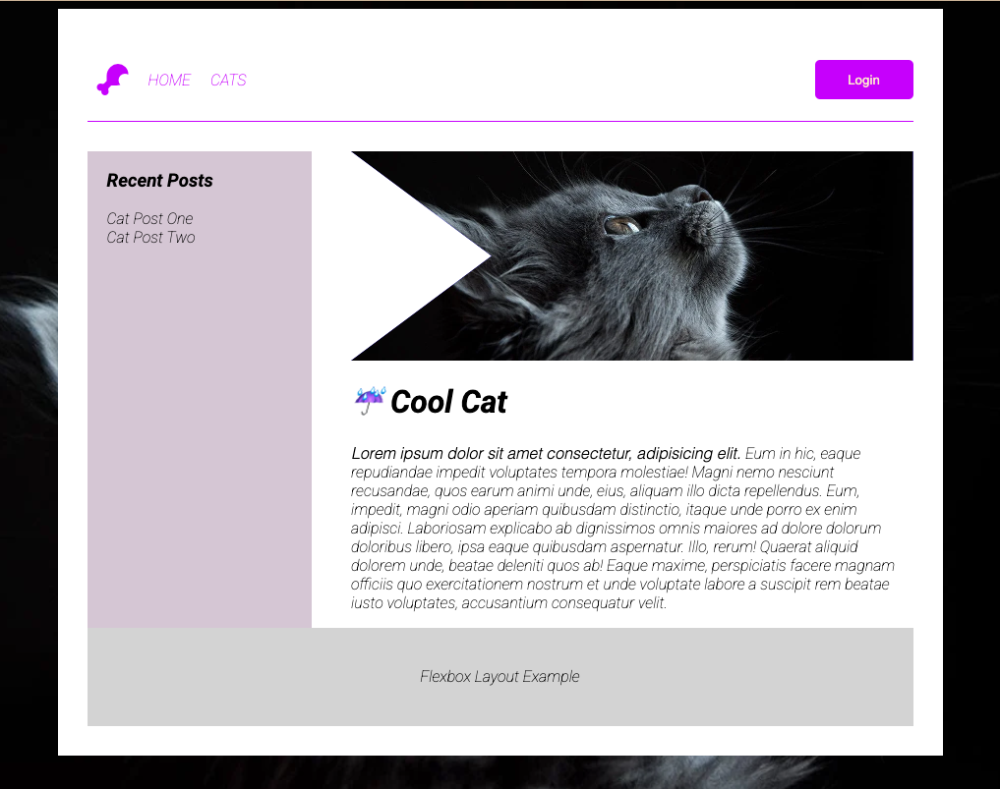
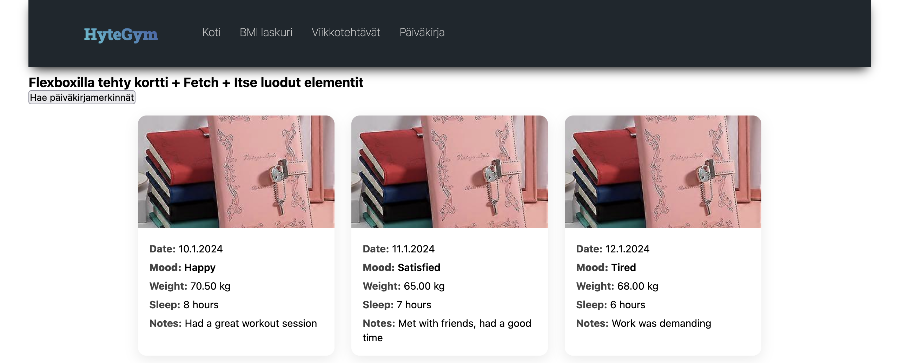

## Flexbox

Flexbox on CSS3:n osa, joka tarjoaa tehokkaan tavan järjestellä ja hallita elementtejä rivi- ja sarakemuodostelmissa joustavasti ja dynaamisesti. "Flexbox" tulee sanasta "Flexible Box", mikä kuvaa sen kykyä mukautua erilaisiin näyttökoon muutoksiin ja sisällön määriin. Flexbox on erityisen hyödyllinen silloin, kun halutaan luoda responsiivisia ja monipuolisia käyttöliittymiä verkkosivuille tai web-sovelluksiin.

Flexboxin avulla voit määrittää, miten elementit järjestellään, sijoitetaan, venytetään ja kutistetaan suhteessa toisiinsa ja niiden ympäristöön. Flexboxin pääperiaatteita ovat joustavuus, suhteellisuus ja helppokäyttöisyys verrattuna perinteisiin CSS-menetelmiin.

[Loistava Flexbox tietosivu : A Complete Guide to Flexbox](https://css-tricks.com/snippets/css/a-guide-to-flexbox/)

Joitakin tärkeitä käsitteitä ja ominaisuuksia Flexboxissa ovat:

**_Flex Container_**: Elementti, joka sisältää flex-item-elementtejä. Tämä määritellään asettamalla CSS-ominaisuus display: flex; tai display: inline-flex; elementille, jonka haluat toimivan flex-containerina.

**_Flex Items_**: Elementit, jotka ovat suora lapsia flex-containerista ja joihin Flexbox-ominaisuudet vaikuttavat. Ne asettuvat joustavasti flex-containerin sisällä.

**_Main Axis ja Cross Axis_**: Flexboxilla on kaksi pääakselia, pääakseli (main axis) ja poikkeusakseli (cross axis), jotka määritellään flex-containerin suuntaan (flex-direction). Pääakseli on oletuksena vaakasuora ja poikkeusakseli pystysuora.

**_Justify Content_**: Ominaisuus, joka määrittää flex-itemien sijoittelun pääakselin suunnassa flex-containerissa.

**_Align Items ja Align Content_**: Ominaisuudet, jotka määrittävät flex-itemien ja flex-containerin välistä sijoittelua poikkeusakselin suunnassa.

**_Flex Grow, Flex Shrink ja Flex Basis_**: Ominaisuudet, jotka määrittävät flex-itemien joustavuuden ja niiden käyttäytymisen suhteessa toisiinsa.

Flexbox tarjoaa monipuolisia mahdollisuuksia layoutien hallintaan ja on tullut yhdeksi tärkeimmistä työkaluista responsiivisen suunnittelun ja joustavien käyttöliittymien toteuttamisessa verkkokehityksessä.

Harjoittelemme aamun tunneila näitä käsitteitä yhdessä, vanhan tutun asemointitehtävän avulla:

[Laatikkoleikki](harjoitukset/vk1-asemointi.html)

Harjoittelemme tekemään vastaavanlaisen layoutin yhdessä:



## Kirjaantuneen käyttäjän apikutsut ja niiden käsittely

### Tehtävä 2 - Kortit

Luo uusi sivu johon haet taustapalvelusta käyttäjän päiväkirjamerkinnät ja luot niille tarvittavan määrän kortteja. Luomisessa ja asemoinnissa käytä Flexbox-layout ominaisuuksia. Voit käyttää korteissa omaa tyylittelyä. Korttien hakuun tarvitset nyt tokenin.



```http
GET {{apiurl}}/entries
Authorization: Bearer {{token}}
```

Jotta me saamme tokenin, on tottakai ensin kirjauduttava sisään. Hae seuraavaksi sisäänkirjatumisfomi, login.html jolla harjoittelemme sisäänkirjautumista sekä tokenien tallentamista täältä:

[Tiedostot](viikkoesimerkit/vk6)

Kun sisäänkirjautuminen onnistuu, ohjataan käyttäjä pääsivulle, jolla käyttäjä voi tehdä rajapintakutsuja sisäänkirjaantuneena, sillä nyt saamme kaikkiin kutsuihin mukaan tokenin tarvittaessa.

## Autentikaatio sekä Tokenit

JWT (JSON Web Token) autentikaatio on menetelmä, joka mahdollistaa turvallisen ja tehokkaan käyttäjän tunnistamisen ja valtuuttamisen web-sovelluksissa ja REST-rajapinnoissa. Se perustuu tokenien käyttöön, jotka ovat pieniä datayksiköitä, jotka sisältävät tietoja käyttäjän tunnistamiseksi ja valtuuttamiseksi. JWT-avainta käytetään usein lähettämään käyttäjän tunnistetietoja, kuten käyttäjätunnus ja rooli, ja se voi myös sisältää muita metatietoja. JWT:t ovat turvallisia, koska ne ovat allekirjoitettuja, mikä tarkoittaa, että niiden alkuperä voidaan varmistaa ja tietoja ei voi muuttaa ilman avainta. REST-rajapinnoissa JWT-tokenit usein välitetään HTTP-otsakkeiden kautta pyyntöjen autentikoimiseksi ja käyttöoikeuksien varmistamiseksi.

JWT-tokenit voidaan lähettää HTTP-pyynnön otsakkeissa. Yleisimmin käytetty otsake on Authorization, joka sisältää JWT-tokenin. Esimerkiksi:

```js
Authorization: Bearer <JWT-tokeni>
```

JWT-tokenin vastaanottaminen tapahtuu vastaavasti. Sovellus tarkistaa saapuvan pyynnön otsakkeista, evästeistä tai pyyntöparametreista JWT-tokenin, joka sisältää tarvittavat käyttäjän tunnistetiedot ja käyttöoikeudet. Sen jälkeen sovellus voi tarkistaa tokenin aitouden ja käyttöoikeudet sen allekirjoituksen avulla. Jos tokeni on validi, sovellus voi antaa käyttäjälle pääsyn pyydettyyn toiminnallisuuteen tai resursseihin.

1. **Käyttäjä kirjautuu sisään:**
   Käyttäjä syöttää käyttäjätunnuksen ja salasanan login-formiin ja lähettää ne backend-palvelimelle.

2. **Backend validoi tunnukset:**
   Palvelin tarkistaa tunnukset ja jos ne ovat oikeat, se generoi JWT-tokenin, joka sisältää allekirjoitetun datan, kuten käyttäjän ID:n ja roolit.

3. **Token palautetaan:**
   Palvelin palauttaa JWT-tokenin frontendiin (yleensä JSON-muodossa).

4. **Token tallennetaan selaimeen:**
   Frontend tallentaa tokenin selaimen muistiin.

   [Logal Storage](https://www.w3schools.com/jsref/prop_win_localstorage.asp)

```js
const response = await fetchData(url, options);
localStorage.setItem('token', response.token);
```

5. **Autentikoidut pyynnöt:**
   Jokaisessa suojatussa API-kutsussa frontend lisää tokenin Authorization-otsikkoon. Palvelin tarkistaa saapuvan tokenin allekirjoituksen ja voimassaolon. Jos token on kelvollinen, pyyntö hyväksytään.

```http
GET {{apiurl}}/entries
Authorization: Bearer {{token}}
```

Edellisten viikkojen items.js koodiin verrattuna, haetaan kutsun yhteydessä nyt selaimen localstorageen tallennettu tokeni. Tämä tokeni lisätään kutsun otsikkoon.

Koodiesimerkki:

```js
const url = 'http://localhost:3000/api/entries';

let headers = {};
let token = localStorage.getItem('token');

if (token) {
	headers = {
		Authorization: `Bearer ${localStorage.token}`,
	};
}
const options = {
	headers: headers,
};

const users = await fetchData(url, options);
```

6. **Uloskirjautuminen:**
   Frontend poistaa tokenin selaimesta.

```js
localStorage.removeItem('token');
```

### Tokenien tallentaminen

Paras tapa tallentaa JWT (JSON Web Token) -autentikointitunniste frontendissä riippuu tarkoituksistasi ja turvallisuusnäkökohdista. Tässä muutamia yleisiä menetelmiä:

- Selaimen evästeet

- Paikallinen tallennustila (Local Storage) tai sessiotallennustila (Session Storage). Käytä localStoragea pysyvään tallennukseen yli selainistuntojen ja sessionStoragea istunto-kohtaiseen tallennukseen.

- Muistivarasto: Tallenna JWT-tunniste muistiin käyttämällä JavaScript-muuttujia. Vaikka tämä menetelmä voi olla turvallinen, se vaatii huolellista hallintaa varmistaaksesi, ettei tunniste vuoda XSS-hyökkäysten kautta.

- IndexedDB: Tallenna JWT-tunniste selainmen omaan tietokantaan.

Jokaisella menetelmällä on omat etunsa ja haittansa turvallisuuden, toteutuksen helppouden ja yhteensopivuuden suhteen eri käyttötapausten kanssa. Harkitse sovelluksesi vaatimuksia ja turvallisuustarpeita valitessasi sopivan tavan tallentaa JWT-tunnisteet frontendissä. Kurssilla käytämme LocalStoragea.

## VAIHTOEHTO jos rajapinta ei toimi

Vinkki: Tähän flexbox korttien generoimiseen voit helposti käyttää chatgpt ym apureita. Anna toivottu html koodi ja pyydä tekoälyä kirjoittamaan elementtien luominen js:n avulla. Tarkista kuitenkin että generoitu koodi on järkevää.

Jos rajapintasi ei vielä toimi, voit toistaiseksi hakea korttien tekstisisällön tiedostosta. Luo **diary.json** niminen tiedosto projektiisi ja siirrä se **public** kansioon ja tee fetch suoraan tiedostoon.

```js
const url = '/diary.json';
const items = await fetchData(url);
```

```json
// väliaikainen testidata
[
	{
		"entry_id": 5,
		"user_id": 5,
		"entry_date": "2024-01-14",
		"mood": "Relaxed",
		"weight": 75.0,
		"sleep_hours": 8,
		"notes": "Spent the day reading",
		"created_at": "2024-01-14T19:00:00"
	},
	{
		"entry_id": 4,
		"user_id": 4,
		"entry_date": "2024-01-13",
		"mood": "Energetic",
		"weight": 55.0,
		"sleep_hours": 9,
		"notes": "Went for a morning run",
		"created_at": "2024-01-13T18:00:00"
	},
	{
		"entry_id": 3,
		"user_id": 3,
		"entry_date": "2024-01-12",
		"mood": "Tired",
		"weight": 68.0,
		"sleep_hours": 6,
		"notes": "Work was demanding",
		"created_at": "2024-01-12T22:00:00"
	},
	{
		"entry_id": 2,
		"user_id": 2,
		"entry_date": "2024-01-11",
		"mood": "Satisfied",
		"weight": 65.0,
		"sleep_hours": 7,
		"notes": "Met with friends, had a good time",
		"created_at": "2024-01-11T21:00:00"
	},
	{
		"entry_id": 1,
		"user_id": 1,
		"entry_date": "2024-01-10",
		"mood": "Happy",
		"weight": 70.5,
		"sleep_hours": 8,
		"notes": "Had a great workout session",
		"created_at": "2024-01-10T20:00:00"
	}
]
```
