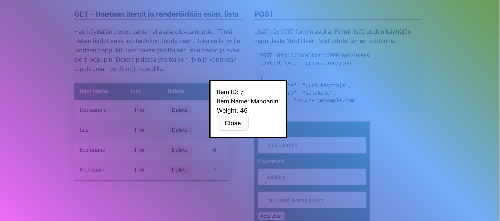

# UIn päivitys, tärkeitä komponentteja

### Modaalit ja Dialogit

**Tutkitaan ensin perus Modaaleja**

https://www.w3schools.com/howto/howto_css_modals.asp

Modaalien kanssa on perinteisesti ollut jonkunverran hankaluuksia, kuten se, että modaalin tausta yhä scrollaantuu vaikkakin käyttäjällä on modaal auki. Näytän tästä tunnilla pari esimerkkiä. Modaaleja korvaamaan on lähivuosina kehitetty uusi html elementti **dialog** joka tarjoaa natiivin tuen modaaleille.

**Dialog**

https://developer.mozilla.org/en-US/docs/Web/HTML/Element/dialog

Käytämme tänään dialogin luomiseen valmista koodia hieman muunneltuna. Dialogin avaamiseen, kuten modaalien tarvitsen hippasen JS koodia. Katso alla oleve CodePen esimerkki.

- https://css-tricks.com/how-to-implement-and-style-the-dialog-element/
- Lue tämä myös tarkkaan: https://developer.mozilla.org/en-US/docs/Web/API/HTMLDialogElement

Lisätään Dialogille myös Backdrop ominaisuus.

- https://css-tricks.com/almanac/selectors/b/backdrop/ <br>
- https://codepen.io/chergav/pen/zYYbjaE
  <br>

### Tehtävä 1 - Listään testisivuille ensin dialogi

Lisää seuraavat rivit html sivuillesi:

```html
<dialog class="info_dialog">
	<div class="item_info">
		<!-- tähän täytetään items tiedot -->
		<!-- # Get item by id -->
		<!-- GET http://127.0.0.1:3000/api/items/1 -->

		<div>
			ItemID:
			<span>Id</span>
		</div>
		<div>
			ItemName:
			<span>Name</span>
		</div>
		<div>
			Weight:
			<span>Weight</span>
		</div>
	</div>
	<button autofocus>Close</button>
</dialog>
```

Esin lisätään koodi jolla dialogi löytyy sekä se voidaan sulkea.

```js
// Dialog
/////////////////////////////

const dialog = document.querySelector('.info_dialog');
const closeButton = document.querySelector('.info_dialog button');
// "Close" button closes the dialog
closeButton.addEventListener('click', () => {
	dialog.close();
});
```

Lisätään nyt kaikille items listan rivien "Info" dekä "Delete" nappuloille tapahtumankuuntelijat. Kun nappuloita klikataan, haetaan tai poistetaan yksittäisen esineen tiedot taustapalvelusta id perusteella. Mikäli Info nappulaa painetaa, avaa se tiedot dialogiin. Tapahtumankuuntelijat voidaan lisätä samassa funktiossa kuin itse taulukon luominen tapahtuu tai vaihtoehtoisesti omana funktionaan kun taulukko on jo luotu.

```js
const addButtonEventListeners = () => {
	document.querySelectorAll('.check').forEach((button) => {
		button.addEventListener('click', async (event) => {
			const itemId = event.target.dataset.id;
			const item = await getItemById(itemId);

			if (item) {
				// Clicking the info button opens the dialog
				dialog.showModal();
				dialog.querySelector('.item_info').innerHTML = `
          <div>Item ID: <span>${item.id}</span></div>
          <div>Item Name: <span>${item.name}</span></div>
          <div>Weight: <span>${item.weight === undefined ? 'Not available' : item.weight}</span></div>`;
			}
		});
	});

	document.querySelectorAll('.del').forEach((button) => {
		button.addEventListener('click', async (event) => {
			const itemId = event.target.dataset.id;
			deleteItemById(itemId);
			// TODO päivitä UI lista tämän jälkeen
		});
	});
};
```

Tyylittele dialogi ja katso että kaikki tiedot tulostuvat dialogiin.


